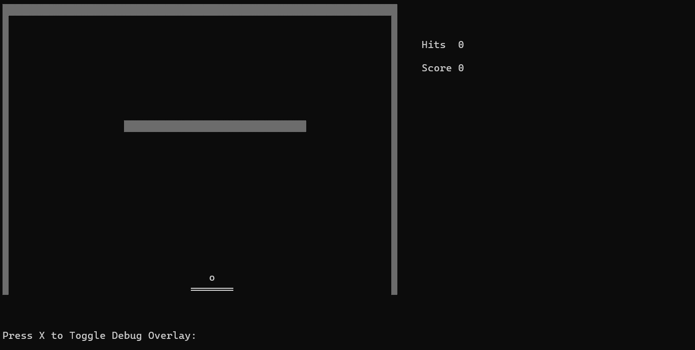

# Arkanoid (C, Console)

<p align="center">
	
</p>

A console-based Arkanoid game written in C to explore low-level game mechanics and physics.

# Features

* Real-time ball physics (sin, cos)
* Collision detection (walls, racket)
* Level system
* Debug overlay

# Tech

* C 
* Windows Console API
* CMake

## Build & Run (Windows)

Make sure you have CMake and a C compiler (e.g. Visual Studio) installed.

```bash
git clone https://github.com/AbdulazizRakhim/Arkanoid
cd Arkanoid
mkdir build
cd build
cmake ..
cmake --build .
```
Run the game:

```bash
.\Arkanoid.exe
```

# Controls

 | Key | Action |
 |:---:| :------:|
 | A | Move left |
 | D | Move right |
 | W | Release ball |
 | X | Debug overlay |
 | ESC | Exit |

# About 

Built to understand how game physics and collision systems work without using a game engine.

# Future Improvements 

* Improve ball reflection based on hit position
* Add sound effects using Raylib or SDL2
* Enhance overall visual polish
* Make the project cross-platform 